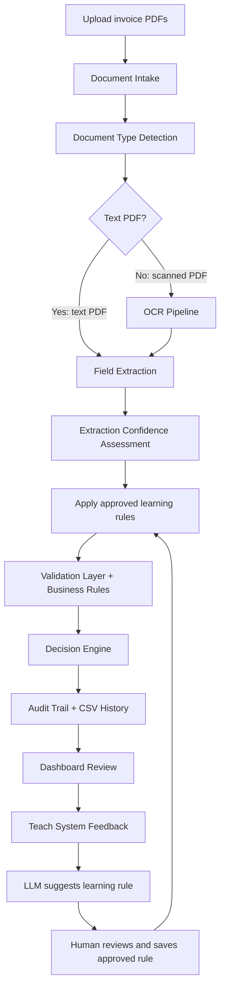

# Zamp Invoice Processor - Architecture README

## Executive Summary

Zamp Invoice Processor is an AI-assisted digital AP employee for invoice intake, extraction, validation, decisioning, audit, and reviewer-guided learning.

The system intentionally separates AI work from compliance work:

- AI extracts messy invoice data and suggests learning rules from human feedback.
- Deterministic rules validate invoices, decide status, and create an auditable trail.
- Human-approved learning rules improve future behavior without allowing the LLM to silently change finance decisions.

This gives the product a "digital employee" experience while keeping AP decisions explainable.

## High-Level Workflow



## Why This Architecture

The key design principle is controlled autonomy.

Invoices are a finance/compliance workflow. A system cannot simply say, "AI decided this invoice is fine." It must explain every decision. That is why validation is deterministic and audit-first.

The LLM is used where it is strongest:

- Reading different invoice formats.
- Converting unstructured PDF text into structured JSON.
- Interpreting reviewer feedback into a proposed learning rule.

Rules are used where predictability matters:

- Vendor approval.
- PO matching.
- Duplicate detection.
- Tolerance checks.
- Tax and currency validation.
- Final status decision.

The result is a digital employee that learns from reviewers, but only through explicit, human-approved, auditable rules.

## Core Files

| File | Responsibility |
|---|---|
| `app.py` | Streamlit UI, upload flow, Dashboard, Teach System UI, CSV history |
| `document_intake.py` | Document ID, file type, received timestamp, text vs scanned PDF classification |
| `extractor.py` | PDF text/OCR extraction and Groq LLM JSON extraction |
| `validator.py` | Deterministic validation checks, status, confidence, audit log |
| `email_generator.py` | Context-specific action summaries and draft emails |
| `learning.py` | Human-approved learning rules and LLM rule suggestions |
| `data/vendor_master.csv` | Vendor database and approval status |
| `data/po_master.csv` | PO database, amounts, currency, status |
| `data/processing_history.csv` | Historical invoice audit trail |
| `data/learning_rules.json` | Approved learning rules, created by reviewers |

## LLM Usage

### 1. Invoice Extraction

Primary model in `extractor.py`:

```python
MODEL_FALLBACK_CHAIN = [
    "llama-3.3-70b-versatile",
    "qwen/qwen3-32b",
    "llama-3.1-8b-instant",
]
```

Why:

- `llama-3.3-70b-versatile` is strong for general language understanding and structured extraction.
- `qwen/qwen3-32b` is faster and useful as a fallback under rate limits.
- `llama-3.1-8b-instant` is the lightweight fallback when higher models are rate-limited.

The extraction call uses `temperature=0` to reduce run-to-run variance.

### 2. Learning Rule Suggestion

Model in `learning.py`:

```python
LEARNING_SUGGESTION_MODEL = "openai/gpt-oss-120b"
```

Why:

- This task is more agentic: read reviewer feedback, inspect invoice context, and propose a structured rule.
- The model is only suggesting. It does not directly change validation behavior.
- The reviewer must approve the JSON rule before it is saved.

If the LLM fails or the API is unavailable, `learning.py` falls back to simple deterministic heuristics so the UI still works.

## Current Groq Model Rationale

As of May 31, 2026, Groq documentation lists:

- `llama-3.3-70b-versatile`: 131K context, 32K max output, JSON/tool support, free-plan limits around 30 RPM / 1K RPD / 12K TPM / 100K TPD.
- `qwen/qwen3-32b`: strong reasoning/coding benchmarks, faster throughput, free-plan limits around 60 RPM / 1K RPD / 6K TPM / 500K TPD.
- `openai/gpt-oss-120b`: agentic/reasoning oriented, JSON/tool support, free-plan limits around 30 RPM / 1K RPD / 8K TPM / 200K TPD.

Recommendation:

- Keep `llama-3.3-70b-versatile` as the extraction primary for demo stability.
- Use `openai/gpt-oss-120b` for learning-rule suggestions because the task is closer to agentic reasoning.
- Do not switch every extraction call to the newest model without running a regression test on all invoices, because extraction consistency matters more than benchmark novelty.

Sources:

- Groq Llama 3.3 70B model docs: https://console.groq.com/docs/model/llama-3.3-70b-versatile
- Groq Qwen3 32B model docs: https://console.groq.com/docs/model/qwen/qwen3-32b
- Groq GPT-OSS 120B model docs: https://console.groq.com/docs/model/openai/gpt-oss-120b
- Groq rate limits: https://console.groq.com/docs/rate-limits

## Validation Checks

The system currently has the original configurable checks plus intake/confidence/PO consistency checks.

| # | Check | Logic |
|---|---|---|
| 0 | OCR Quality | Routes scanned PDFs with low OCR confidence to manual review |
| 0 | Extraction Confidence | Routes low-confidence extraction to manual review |
| 1 | Invoice Date Sanity | Flags future-dated or stale invoices |
| 2 | Critical Fields | Ensures invoice number, vendor, and total amount exist |
| 3 | Credit Note Detection | Detects negative amount, `CN-` prefix, or credit/refund/reversal text |
| 4 | Duplicate Detection | Rejects duplicate invoice number + fuzzy vendor match from history |
| 5 | Vendor Verification | Fuzzy matches vendor master and rejects unapproved vendors |
| 6 | PO Matching | Direct PO lookup, fuzzy inference, and closed PO detection |
| 7 | Vendor-PO Match | Rejects when invoice vendor does not match the PO vendor |
| 8 | Invoice Date vs PO Date | Flags invoices dated before the PO creation date |
| 9 | Amount Comparison | Compares invoice amount vs PO amount using tolerance |
| 10 | Cumulative Invoicing | Tracks non-rejected invoices against the same PO |
| 11 | Currency Validation | Flags currencies outside the allowed list |
| 12 | Currency Match | Flags invoice currency vs PO currency mismatch |
| 13 | Tax Rate Verification | Applies GST check only when appropriate; skips non-INR GST checks |

## Decision Logic

The final status is derived from the validation check outcomes.

| Status | Meaning |
|---|---|
| `Approved` | No rejection or review flag remains |
| `Flagged for Review` | Needs human review but may still be valid |
| `Rejected` | Hard-stop issue such as duplicate, unknown vendor, unapproved vendor, or major amount variance |

Important design choices:

- Credit notes short-circuit standard validation because they follow a different AP workflow.
- Currency runs before tax so EUR/VAT invoices do not incorrectly fail Indian GST validation.
- Currency is also compared to the PO currency when the PO is matched.
- Vendor identity is checked against both the vendor master and the matched PO.
- Invoices dated before PO creation are routed to manual review.
- Low OCR or low extraction confidence routes to manual review before normal business confidence can hide the risk.
- Tax validation is skipped for non-INR invoices unless a reviewer-approved rule says otherwise.
- Suggested actions are selected by failed-check priority rather than fragile text matching.

## Teach System Learning Loop

The Dashboard now includes a Teach System panel for each invoice.

Reviewer flow:

1. Reviewer opens an invoice in the Dashboard.
2. Reviewer writes feedback in natural language.
3. LLM suggests a structured learning rule.
4. Reviewer reviews or edits the JSON.
5. Reviewer clicks Save Approved Rule.
6. Future invoices apply that approved rule before validation.
7. The audit trail shows `Learned Rule Applied`.

Supported learning rule types:

| Rule Type | Example |
|---|---|
| `vendor_alias` | Treat `Delta Logistics Pvt` as `Delta Logistics` |
| `po_mapping` | Map an extracted PO alias to a canonical PO |
| `credit_pattern` | Treat invoices containing `Credit Adjustment` as credit notes |
| `credit_note_policy` | Approve credit notes for a specific vendor without routing to manual review |
| `tax_currency_exception` | Skip GST for approved EUR/VAT invoices from a specific vendor |
| `general_note` | Store reviewer knowledge without changing validation |

Why this is safe:

- The LLM never directly approves or rejects invoices.
- A human must save the rule.
- Saved rules are deterministic JSON records.
- Every applied rule appears in the audit trail.

## Edge Cases Covered

### PDF and Extraction Edge Cases

- Vendor format variations.
- Itemized vs bundled line items.
- Tax embedded vs separated.
- Explicit PO, missing PO, and fuzzy inferred PO.
- Missing critical fields.
- Scanned PDFs through OCR fallback.
- Blank/corrupted PDFs routed to manual processing.

### Business Validation Edge Cases

- Duplicate invoices.
- Unknown vendors.
- Vendors found but not approved.
- Closed PO invoices.
- Credit notes and negative invoices.
- Future-dated invoices.
- Stale invoices.
- Amount tolerance boundary.
- Amount far above PO.
- Split/cumulative invoicing.
- Tax rate mismatch.
- Currency mismatch.
- Vendor-PO mismatch.
- Invoice date before PO date.
- Low OCR confidence.
- Low extraction confidence.

### Learning Edge Cases

- Vendor alias correction.
- PO mapping correction.
- Credit pattern correction.
- Tax/currency exception.
- General reviewer note when feedback is unclear.

## Known Demo Guidance

- Clear history before running duplicate or cumulative tests.
- Run original invoice before duplicate invoice.
- Run first partial invoice before cumulative-over invoice.
- Keep stale threshold high during general demos if old 2024 test invoices should not all be flagged.
- Export CSV from `All` filter if you want the full result set.

## What Is Logically Strong

- AI and deterministic rules are separated cleanly.
- All decisions have check-level audit trails.
- Learning is human-approved, not uncontrolled self-training.
- Currency now gates tax logic correctly.
- Credit notes preserve negative amounts.
- Suggested action priority is based on failed checks.
- Rule application is visible through `Learned Rule Applied` audit rows.
- Intake metadata records document ID, file type, document type, OCR confidence, and extraction confidence.
- New validation outcomes carry machine-readable error codes such as `LOW_OCR_CONFIDENCE`, `VENDOR_PO_MISMATCH`, `CURRENCY_MISMATCH`, and `INVALID_DOCUMENT_TIMELINE`.

## Recommended Future Improvements

These are not required for the current case study, but they are useful production next steps:

1. Add a simple Learning Rules management page to enable/disable/delete rules.
2. Add JSON Schema Mode for LLM extraction once tested against all sample invoices.
3. Add test automation for all 12 demo invoices and all 29 generated test cases.
4. Store original extracted data and post-learning corrected data separately for full lineage.
5. Add ERP integration so vendor/PO master data comes from SAP, Oracle, or NetSuite.
6. Add approval workflow for manager sign-off on flagged invoices.

## Final Architecture Positioning

This is not just an invoice checker. It is a controlled digital AP employee:

- It reads invoices.
- It checks them against company rules.
- It explains decisions.
- It drafts next actions.
- It remembers approved reviewer feedback.
- It improves over time without losing auditability.
